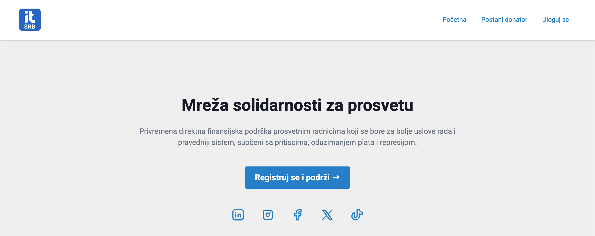

[](../../actions/workflows/build.yml)


# Mreža Solidarnosti
Mreža solidarnosti je inicijativa IT Srbije za direktnu finansijsku podršku nastavnicima i vannastavnom osoblju čija je plata umanjena zbog obustave rada.



## Tehnologije

- [PHP 8.3](https://www.php.net/)
- [NGINX](https://nginx.org/)
- [MySQL 8](https://www.mysql.com/)
- [Docker](https://www.docker.com/)
- [Symfony 6.4](https://symfony.com/)
- [TailwindCSS 4](https://tailwindcss.com/)
- [daisyUI 4](https://daisyui.com/)
- [Tabler Icons](https://tabler.io/icons)

---

## Instalacija projekta

Pratite sledeće korake kako biste pokrenuli projekat lokalno:

1. Klonirajte projekat
```bash
$ git clone https://github.com/IT-Srbija-Org/solidaritySF;
cd solidaritySF;
```

2. Pokrenite skriptu za konfiguraciju
```bash
$ ./configureProject.sh
```

3. Otvorite URL adresu u pretraživaču: http://localhost:1000

4. Ako zelite podesite git hooks za proveru koda pre svakog push-a:
```bash
$ cp git-hooks/pre-push .git/hooks/pre-push
$ chmod +x .git/hooks/pre-push
```

Ova podešavanja će automatski pokrenuti proveru koda pre svakog push-a:
- Provera sintakse Twig templtes
- Provera sintakse YAML konfiguracionih fajlova
- Provera Symfony container-a
- PHPStan statička analiza
- PHP CS Fixer provera sintakse i stilskih pravila

Možete i ručno pokrenuti sve provere pomoću komande:
```bash
$ docker exec solidarity-php-container php bin/console app:lint:all
```

---

## Test korisnici

Test korisnici se automatski kreiraju pomoću [DoctrineFixturesBundle](https://symfony.com/bundles/DoctrineFixturesBundle) tokom pokretanja skripte za konfiguraciju.

| Email              | Privilegije  |
|--------------------|--------------|
| korisnik@gmail.com | ROLE_USER    |
| delegat@gmail.com  | ROLE_DELEGAT |
| admin@gmail.com    | ROLE_ADMIN   |

Nakon unosa email adrese, link za prijavu će biti dostupan na adresi http://localhost:1002
(Mailcatcher servis koji hvata sve email poruke u razvojnom okruženju).

---

## Hvala ❤

 <a href = "https://github.com/IT-Srbija-Org/solidaritySF/graphs/contributors">
   
 </a>
